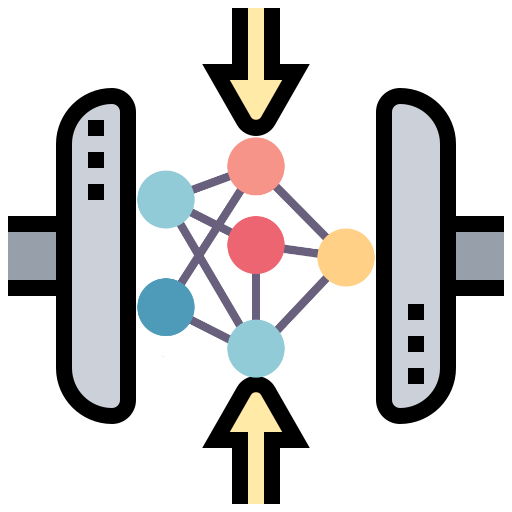

#  *compnet* — Compression for Market Network data 

[](https://dl.circleci.com/status-badge/redirect/gh/LucaMingarelli/compnet/tree/main)
[](#)
[](https://pypi.org/project/compnet/)
[](https://github.com/LucaMingarelli/compnet/blob/master/LICENSE.txt)

[//]: # ([![Downloads]&#40;https://static.pepy.tech/personalized-badge/compnet?period=total&units=international_system&left_color=grey&right_color=blue&left_text=Downloads&#41;]&#40;https://pepy.tech/project/compnet&#41;)


# About

***compnet*** is a package for market compression of network data.

It is based on xxx.


# How to 

Given the network with *graph* $G$, the 
```python


```


# Authors
Luca Mingarelli, 2022

[](#)
